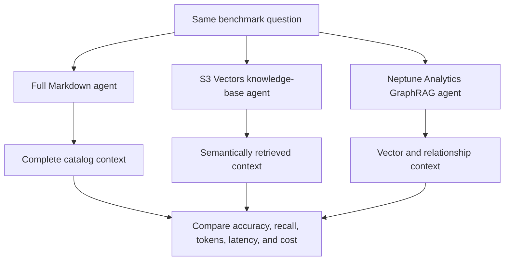
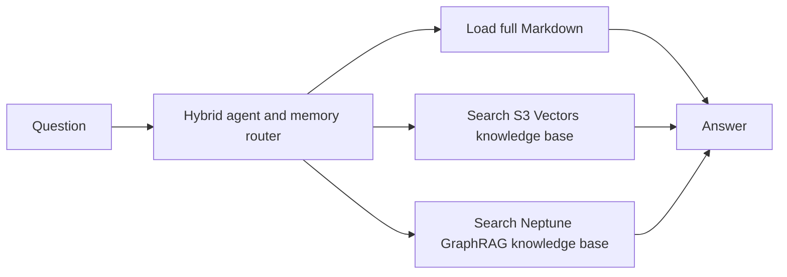

# Building a Semantic Layer with Amazon S3 Vectors


Natural-language query agents need to discover the right tables before they can generate useful
SQL. Sending the complete lakehouse catalog on every request works at small scale, but its token
usage grows with every country, domain, and medallion layer—even when the answer needs one table.

This repository isolates that table-discovery problem and provides a reproducible benchmark for
one narrow question:

> How do full-catalog context, semantic vector retrieval, graph retrieval, and hybrid routing trade
> off across different kinds of table-discovery questions?

It does not deploy a lakehouse, execute SQL, or require Amazon Athena. The experiment isolates
context retrieval so the trade-off is easy to measure.

## Benchmark architecture

The benchmark includes three specialized agents.
Every agent receives the same question, uses the same generation model and output contract, and
differs only in the knowledge source it can access.



The first phase forces every question through all three agents. This isolates the performance of
each knowledge strategy without mixing it with routing quality.

A second phase gives one hybrid agent access to all three knowledge sources. The agent must choose
the smallest sufficient retrieval path, combine sources when necessary, and fall back to the full
catalog when targeted retrieval is insufficient.



The hybrid path is benchmarked rather than assumed to be better. Its results include the chosen
route and source-call count in addition to the metrics collected for the three specialized agents.

All four paths in the diagrams are implemented. The original direct S3 Vectors path remains
available as an optional legacy baseline, but it is not one of the three Knowledge Base comparison
agents.

## What we built

The benchmark generates a fully synthetic catalog with 300 table descriptions across Argentina,
Mexico, and the United States. Each table includes its business description, important columns,
country, domain, bronze, silver, or gold layer, and explicit lineage relationships for the core
tables. It writes both one complete Markdown catalog and one Markdown document per table so the two
Bedrock Knowledge Bases can ingest the identical corpus.

It asks the same Amazon Bedrock model the same classified table-selection questions using four
paths:

1. **Full Markdown:** load all table descriptions into every model request.
2. **S3 Vectors Knowledge Base:** call Bedrock `Retrieve` against the S3 Vectors-backed KB.
3. **Neptune Analytics GraphRAG:** call the same Bedrock `Retrieve` operation against the graph KB.
4. **Hybrid router:** expose the three sources as tools and let the model choose one or combine
   them.

No business data, SQL engine, or real data catalog is required.

## Latest four-strategy result

On September 13, 2026, we ran the complete disposable benchmark in `us-east-1` with the default
300-table catalog, 13 classified questions, three repetitions, `TOP_K=5`, Amazon Nova Micro for
table selection, Amazon Titan Text Embeddings V2, and Amazon Nova Micro for graph construction.
Both Knowledge Bases indexed all 300 documents with zero failures, producing 156 measured answers.

| Strategy | Exact match | Category-macro exact | Mean F1 | Mean input tokens | Input reduction vs. Markdown | Mean latency |
| --- | ---: | ---: | ---: | ---: | ---: | ---: |
| Full Markdown | **92.3%** | **91.7%** | **0.985** | 30,367.8 | — | 1,354.3 ms |
| S3 Vectors KB | 84.6% | 66.7% | 0.938 | **719.1** | 97.6% | **1,017.5 ms** |
| Neptune GraphRAG KB | 69.2% | 50.0% | 0.854 | **712.1** | 97.7% | 1,725.1 ms |
| Hybrid router | 84.6% | 66.7% | **0.963** | 4,036.7 | **86.7%** | 2,805.5 ms |

Exact match varied materially by question type:

| Question category | Full Markdown | S3 Vectors KB | Neptune GraphRAG KB | Hybrid router |
| --- | ---: | ---: | ---: | ---: |
| Semantic lookup | 100.0% | 100.0% | 100.0% | 100.0% |
| Layer intent | 100.0% | 100.0% | 100.0% | 100.0% |
| Relationship traversal | 66.7% | 66.7% | 0.0% | 66.7% |
| Cross-catalog scope | 100.0% | 0.0% | 0.0% | 0.0% |

The result illustrates the trade-off rather than identifying one universal winner:

- Full Markdown achieved the highest exact match and F1, but sent roughly 42 times as many input
  tokens as either managed Knowledge Base.
- Both managed Knowledge Bases achieved 100% exact match for semantic lookup and layer-intent
  questions while reducing input context by more than 97% relative to Full Markdown. In this run,
  the S3 Vectors KB also had the lowest mean end-to-end latency.
- The hybrid router improved mean F1 over both individual Knowledge Bases while using 86.7% fewer
  input tokens than Full Markdown. It matched the S3 Vectors KB's exact-match rate rather than the
  Full Markdown result.
- Routing quality became part of the problem. The hybrid agent used only the S3 Vectors KB for 27
  answers and combined S3 Vectors with Neptune for 12; it never loaded Full Markdown. Its miss on
  the cross-catalog question shows that access to every memory source does not automatically retain
  every source's strengths.
- Neptune GraphRAG did not outperform the other strategies on relationship traversal in this
  configuration. That is an observation about this synthetic corpus, graph construction model,
  prompt, retrieval depth, and question set—not a general claim about graph retrieval. It motivates
  follow-up experiments with retrieval depth, graph-oriented document design, reranking, and
  routing policy.

The committed benchmark report is generated locally under `.benchmark/results/` and excluded from
Git because it contains run-specific identifiers and timestamps. Reproduce the measurement with
the `make demo` command below.

## Earlier two-strategy baseline

A pre-GraphRAG run on August 30, 2026 used the default 300-table catalog, nine deterministic
questions, `TOP_K=5`, Amazon Nova Micro, and Amazon Titan Text Embeddings V2 in `us-east-1`:

| Strategy | Accuracy | Mean input tokens | Mean latency | Estimated variable cost/question |
| --- | ---: | ---: | ---: | ---: |
| Full Markdown catalog | 100% | 29,888.3 | 1,391.6 ms | $0.00104814 |
| S3 Vectors retrieval | 100% | 2,094.6 | 2,104.6 ms | $0.00010408 |

In this run, retrieval reduced mean model input by **93.0%** and the included variable-cost estimate
by **90.1%**, with the same 9/9 table-selection accuracy. It added latency because the agent first
generated an embedding, queried S3 Vectors, and completed a second model call.

These are sample measurements, not service guarantees. Run the benchmark in your own account and
Region before using them for an architecture decision.

## What the benchmark measures

Every forced agent uses the same question, generation model, temperature, output contract, Top-K,
and table-selection policy. Both managed Knowledge Bases are queried through Bedrock `Retrieve`,
so the comparison does not accidentally mix retrieval quality with different generation APIs.

Questions are classified as `semantic_lookup`, `layer_intent`, `relationship_traversal`, or
`cross_catalog_scope`. The category is never passed to an agent; it is used only to aggregate the
results afterward.

The report records exact match, selection precision/recall/F1, retrieval recall, tokens, retrieval
and end-to-end latency, route and source-call count, and a deliberately scoped cost estimate. Both
micro accuracy and category-macro accuracy are shown so the larger semantic-lookup category cannot
hide poor relationship traversal.

## Run the four-strategy benchmark

Prerequisites:

- Terraform 1.8 or newer
- uv
- AWS CLI v2
- AWS credentials with access to S3, S3 Vectors, Bedrock Knowledge Bases, IAM, Cloud Control,
  and Neptune Analytics
- An AWS Region supporting those services and the configured models

Run the complete disposable experiment:

```bash
make demo AWS_PROFILE=your-profile AWS_REGION=us-east-1
```

`make demo` executes `up -> benchmark -> destroy`. It generates the corpus, creates a private source
bucket, uploads the same files for both data sources, provisions both Knowledge Bases and their
stores, waits for both ingestion jobs, runs all four strategies, and destroys everything. Its exit
trap calls `destroy` even when provisioning, ingestion, or benchmarking fails.

Neptune Analytics is configured at the service minimum of 16 m-NCUs with zero replicas. It incurs
charges while it exists, so prefer `make demo` unless you intentionally need repeated runs.

Override scale, repetitions, retrieval depth, or graph-construction model:

```bash
make demo \
  AWS_PROFILE=your-profile \
  TABLES_PER_COUNTRY=300 \
  REPETITIONS=3 \
  TOP_K=10 \
  GRAPH_CONSTRUCTION_MODEL_ID=amazon.nova-micro-v1:0
```

If you already have two compatible Knowledge Bases, generate the corpus separately, upload and sync
it yourself, then supply their IDs:

```bash
make generate TABLES_PER_COUNTRY=100
make benchmark \
  AWS_PROFILE=your-profile \
  S3_VECTORS_KB_ID=XXXXXXXXXX \
  NEPTUNE_KB_ID=YYYYYYYYYY \
  REPETITIONS=3
```

When both IDs are present, the default strategies are `full_markdown`, `s3_vectors_kb`,
`neptune_graphrag_kb`, and `hybrid`. Use `BENCHMARK_STRATEGIES` to run a subset, for example:

```bash
make benchmark \
  S3_VECTORS_KB_ID=XXXXXXXXXX \
  NEPTUNE_KB_ID=YYYYYYYYYY \
  BENCHMARK_STRATEGIES=full_markdown,s3_vectors_kb,neptune_graphrag_kb
```

The graph-construction model and embedding configuration are properties of the Knowledge Bases.
Keep them fixed for a published run and document their values alongside the generated
`run-metadata.json`.

## Resource lifecycle

Lifecycle safety is a primary design requirement.

### `make up`

```bash
make up AWS_PROFILE=your-profile
```

This command:

1. Validates local tools and AWS credentials.
2. Generates the synthetic catalog and one Knowledge Base document per table.
3. Runs `terraform init`, formatting checks, validation, and apply.
4. Creates the private S3 corpus bucket, the direct legacy vector index, both Knowledge Bases,
   their vector stores, least-privilege roles, and the Neptune Analytics graph.
5. Uploads the identical corpus used by both Knowledge Bases.
6. Verifies model access and waits for both ingestion jobs to complete.
7. Creates the vectors for the optional direct S3 Vectors baseline.

If any step fails, `up` invokes `destroy` before returning an error. A successful `up` intentionally
leaves resources running so benchmarks can be repeated.

### `make destroy`

```bash
make destroy AWS_PROFILE=your-profile
```

This command:

1. Deletes all vectors from the exact direct-baseline index.
2. Runs `terraform destroy`, including both data sources, both Knowledge Bases, Neptune Analytics,
   IAM roles, the corpus bucket, and both vector buckets.
3. Uses an exact-name AWS API fallback for the direct vector index if Terraform deletion fails.
4. Fails unless all project buckets, Knowledge Bases, and the Neptune graph are verified absent.

The Terraform vector bucket also sets `force_destroy = true`. Resource names are deterministic and
include the AWS account and Region, allowing cleanup even if local Terraform output is unavailable.

Do not rename `PROJECT_NAME`, switch accounts, or switch Regions between `up` and `destroy`.

## Security and privacy

- The repository contains only synthetic table names, descriptions, columns, and questions.
- AWS credentials are never stored in the project. boto3, the AWS CLI, and Terraform use the
  standard AWS credential chain or the `AWS_PROFILE` supplied at runtime.
- Generated catalogs, benchmark output, Terraform state, variable files, `.env` files, and local
  tool caches are excluded from Git.
- Resource names are derived at deployment time. No AWS account ID or local profile name is
  committed.
- Terraform scopes every resource to this benchmark. `make demo` destroys the corpus bucket, vector
  buckets, Knowledge Bases, IAM roles, and Neptune graph and verifies their absence before exiting.

Review the generated `.benchmark/` artifacts before sharing them if you replace the synthetic
catalog or questions with your own organizational metadata.

## Repeat a benchmark

After `make up`, run:

```bash
make benchmark AWS_PROFILE=your-profile REPETITIONS=3 TOP_K=5
```

Then remove the infrastructure:

```bash
make destroy AWS_PROFILE=your-profile
```

## Outputs

Generated artifacts are written below `.benchmark/`:

```text
.benchmark/
├── catalog.json
├── catalog.md
├── index-metrics.json
├── infrastructure.json
├── knowledge-base-documents/
│   └── one Markdown file per table
└── results/
    ├── comparison.csv
    ├── raw-results.json
    ├── run-metadata.json
    └── summary.md
```

Per-question results include:

- expected, retrieved, and selected tables
- question category, exact match, selection precision/recall/F1, and retrieval recall
- metadata filters chosen by the agent
- knowledge sources and number of source calls used by the hybrid router
- model input and output tokens
- query embedding tokens
- retrieval and end-to-end latency
- estimated variable cost

## Cost methodology

Pricing defaults are dated and recorded in every run. The current defaults use:

- Amazon Nova Micro model input and output tokens
- Amazon Titan Text Embeddings V2 input tokens
- the S3 Vectors per-query API charge

The per-question estimate for the legacy direct path intentionally excludes S3 Vectors storage,
PUT, query-processing, and data-return charges because those depend on logical vector and metadata
size. Indexing metrics are reported separately so one-time ingestion cost is not mixed with
per-question retrieval cost.

For the Bedrock Knowledge Base and hybrid paths, `estimated_cost_usd` contains model-token cost
only. The `Retrieve` response does not expose an itemized retrieval charge, so the report labels
those rows `model_only` instead of presenting an incomparable total as if it were complete. Add the
corresponding AWS billing measurements before making a final cost claim.

Before publishing results, verify the rates in `Pricing` against the official AWS pricing pages.

## Infrastructure

Terraform creates:

- one private, encrypted S3 bucket shared by both Knowledge Base data sources
- one S3 Vectors bucket and index for the original direct-API baseline
- one separate S3 Vectors bucket and Bedrock-compatible index for the managed vector KB
- one 16 m-NCU Neptune Analytics graph with vector search, zero replicas, and no public access
- two Bedrock Knowledge Bases and their data sources
- separate least-privilege Bedrock execution roles for S3 Vectors and Neptune

Both managed stores use the same 256-dimensional Titan embeddings. The S3 Knowledge Base index
uses Bedrock's reserved non-filterable metadata fields. The direct legacy index keeps its metadata
filters and cosine distance so historical results remain reproducible.

## Development

```bash
uv sync
make check
```

The AWS profile is never hardcoded. The default profile name is `default`; pass `AWS_PROFILE` on the
command line or export it in your shell.

## License

MIT
